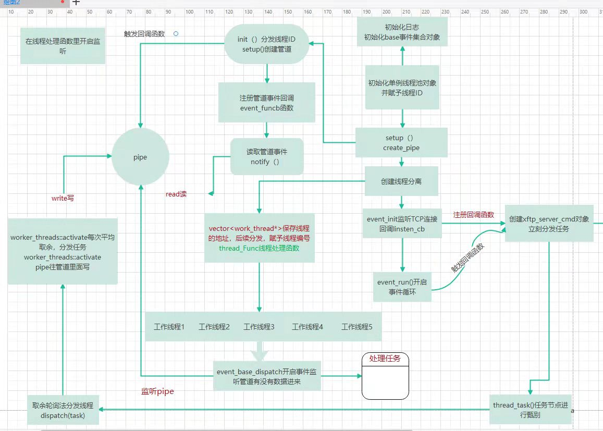

# CHN 01 概述

**libevent_-rrmove**是因为鄙人不善于奔跑……

是一个基于C++11和`libevent`和`memcached`以及类似实现了`ftp`的服务器


## 系统要求

- Linux内核应不低于2.6.9，64位版本，最好是Ubantu18.04；
- g++版本应该不低于C++17
- 构建工具是cmake,cmake版本应不低于3.1；
- git版本管理工具；


## 依赖库

- zlib用于支持HTTP加密传输
- OpenSSL用于后续拓展业务的数据的加密和解密
- boost，版本**不低于1.61**，可能后续会用
- libmysqlclient MySQL客户端
- sudo apt install libmysqlclient-dev
- ubantu18.04版本优先
- libevent 2.0以上版本
- glog 0.6.0版本

## 构建项目

```shell
cd $WORK_PATH
git clone git@gitee.com:ak47chen111/libevent_-rrmove.git
cd libevent_-rrmove/
mkdir build
cd build
cmake ..
make 
./RRmove
```




目前

- 经费不足
- 剧本暂无
- 演员未定